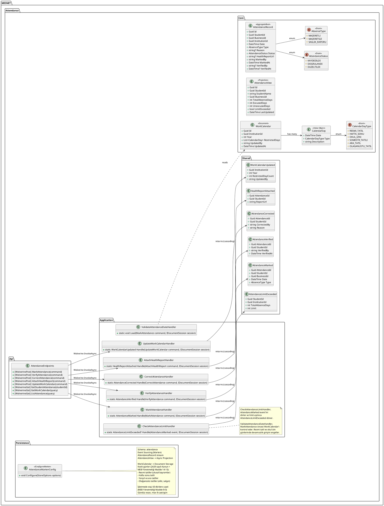
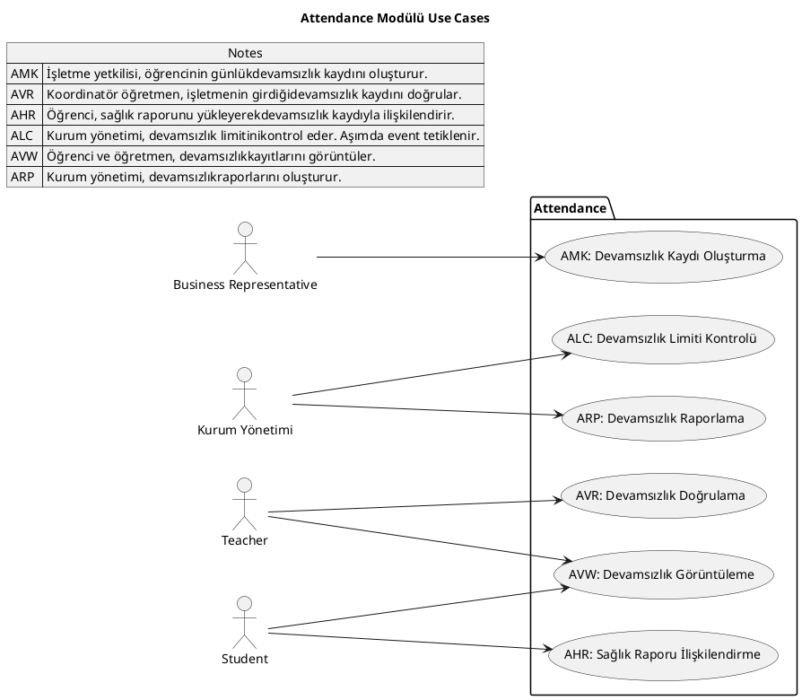
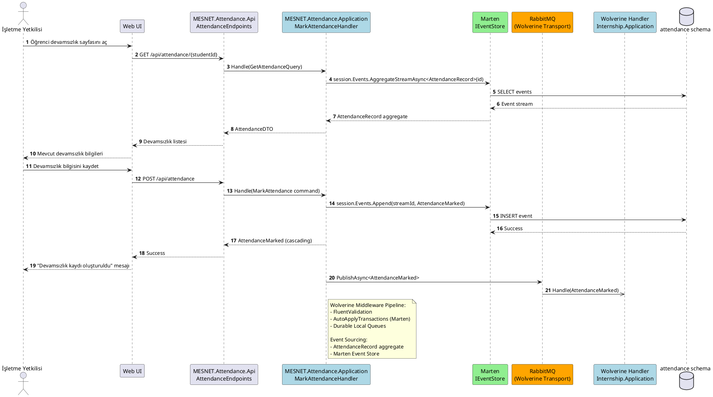
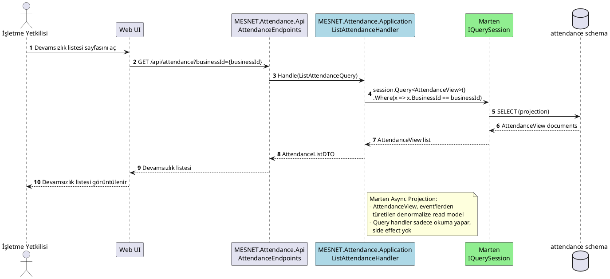

# Attendance Modülü

Devamsızlık kaydı, doğrulama, limit kontrolü, iş takvimi.

## Class Diagram

## Use Cases

## Sequence Diagrams

### Devamsızlık Düzenle (EditStudentAttendance)

### Devamsızlık Listele (ListStudentAttendance)

