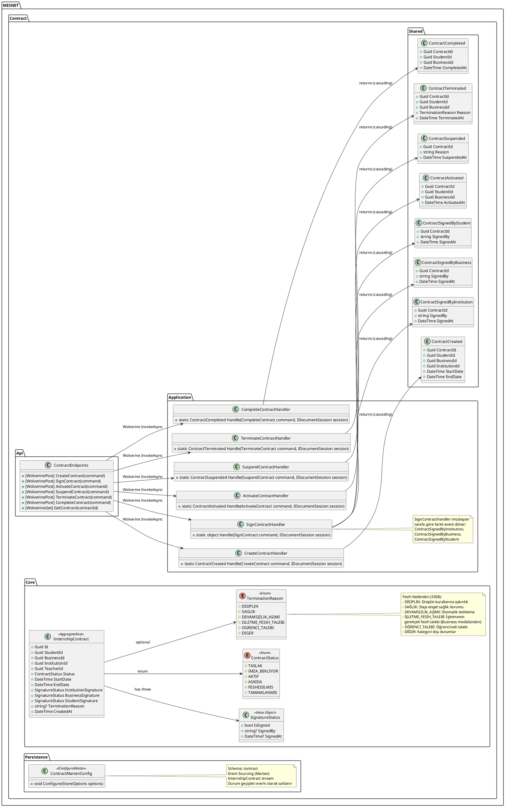
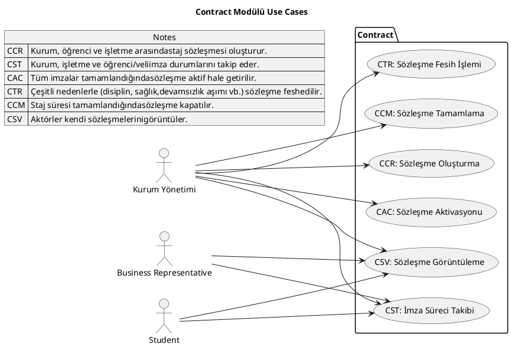
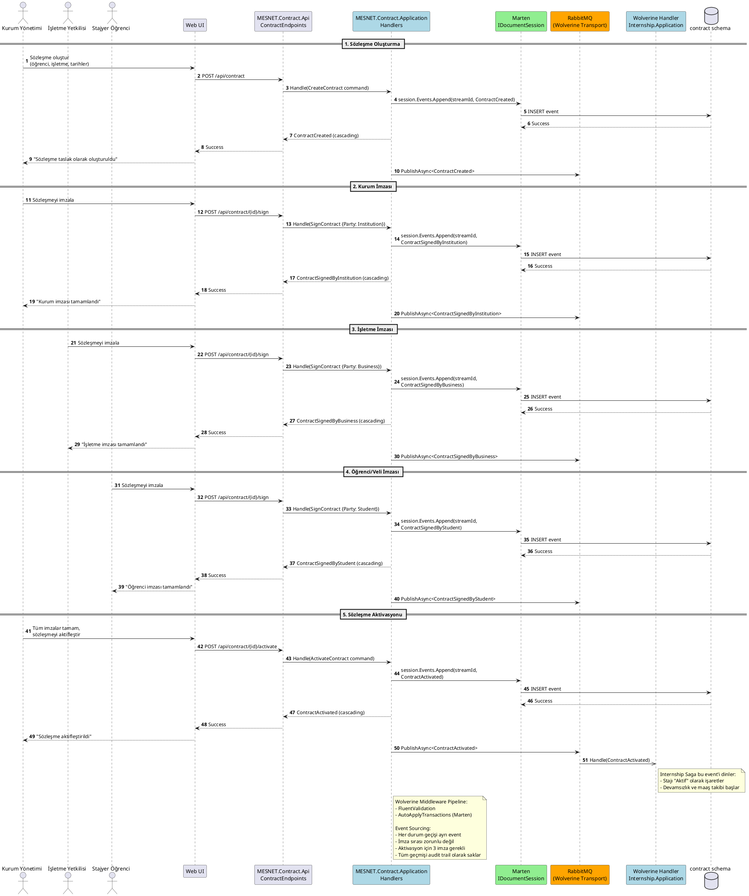

# Contract Modülü

Staj sözleşmeleri, imza süreçleri, fesih işlemleri.

## Class Diagram

```plantuml
@startuml ClassDiagram
left to right direction

package "MESNET.Contract.Api" {
    class ContractEndpoints {
        +[WolverinePost] CreateContract(command)
        +[WolverinePost] SignContract(command)
        +[WolverinePost] ActivateContract(command)
        +[WolverinePost] SuspendContract(command)
        +[WolverinePost] TerminateContract(command)
        +[WolverinePost] CompleteContract(command)
        +[WolverineGet] GetContract(contractId)
    }
}

package "MESNET.Contract.Application" {
    class CreateContractHandler {
        +static ContractCreated Handle(CreateContract command, IDocumentSession session)
    }

    class SignContractHandler {
        +static object Handle(SignContract command, IDocumentSession session)
    }

    class ActivateContractHandler {
        +static ContractActivated Handle(ActivateContract command, IDocumentSession session)
    }

    class SuspendContractHandler {
        +static ContractSuspended Handle(SuspendContract command, IDocumentSession session)
    }

    class TerminateContractHandler {
        +static ContractTerminated Handle(TerminateContract command, IDocumentSession session)
    }

    class CompleteContractHandler {
        +static ContractCompleted Handle(CompleteContract command, IDocumentSession session)
    }

    note "SignContractHandler imzalayan\ntarafa göre farklı event döner:\nContractSignedByInstitution,\nContractSignedByBusiness,\nContractSignedByStudent" as SignNote
    SignContractHandler .. SignNote
}

package "MESNET.Contract.Core" {
    class InternshipContract <<AggregateRoot>> {
        +Guid Id
        +Guid StudentId
        +Guid BusinessId
        +Guid InstitutionId
        +Guid TeacherId
        +ContractStatus Status
        +DateTime StartDate
        +DateTime EndDate
        +SignatureStatus InstitutionSignature
        +SignatureStatus BusinessSignature
        +SignatureStatus StudentSignature
        +string? TerminationReason
        +DateTime CreatedAt
    }

    class SignatureStatus <<Value Object>> {
        +bool IsSigned
        +string? SignedBy
        +DateTime? SignedAt
    }

    enum ContractStatus <<Enum>> {
        #TASLAK
        #IMZA_BEKLIYOR
        #AKTIF
        #ASKIDA
        #FESHEDILMIS
        #TAMAMLANMIS
    }

    enum TerminationReason <<Enum>> {
        #DISIPLIN
        #SAGLIK
        #DEVAMSIZLIK_ASIMI
        #ISLETME_FESIH_TALEBI
        #OGRENCI_TALEBI
        #DIGER
    }

    note "Fesih Nedenleri (3308):\n- DİSİPLİN: Disiplin kurallarına aykırılık\n- SAĞLIK: Staja engel sağlık durumu\n- DEVAMSIZLIK_AŞIMI: Otomatik tetikleme\n- İŞLETME_FESİH_TALEBİ: İşletmenin\n  gerekçeli fesih talebi (Business modülünden)\n- ÖĞRENCİ_TALEBİ: Öğrenci/veli talebi\n- DİĞER: Kategori dışı durumlar" as TermNote
    TerminationReason .. TermNote
}

package "MESNET.Contract.Shared" {
    class ContractCreated {
        +Guid ContractId
        +Guid StudentId
        +Guid BusinessId
        +Guid InstitutionId
        +DateTime StartDate
        +DateTime EndDate
    }

    class ContractSignedByInstitution {
        +Guid ContractId
        +string SignedBy
        +DateTime SignedAt
    }

    class ContractSignedByBusiness {
        +Guid ContractId
        +string SignedBy
        +DateTime SignedAt
    }

    class ContractSignedByStudent {
        +Guid ContractId
        +string SignedBy
        +DateTime SignedAt
    }

    class ContractActivated {
        +Guid ContractId
        +Guid StudentId
        +Guid BusinessId
        +DateTime ActivatedAt
    }

    class ContractSuspended {
        +Guid ContractId
        +string Reason
        +DateTime SuspendedAt
    }

    class ContractTerminated {
        +Guid ContractId
        +Guid StudentId
        +Guid BusinessId
        +TerminationReason Reason
        +DateTime TerminatedAt
    }

    class ContractCompleted {
        +Guid ContractId
        +Guid StudentId
        +Guid BusinessId
        +DateTime CompletedAt
    }
}

package "MESNET.Contract.Persistence" {
    class ContractMartenConfig <<IConfigureMarten>> {
        +void Configure(StoreOptions options)
    }

    note "Schema: contract\nEvent Sourcing (Marten)\nInternshipContract stream\nDurum geçişleri event olarak saklanır" as PersistenceNote
    ContractMartenConfig .. PersistenceNote
}

' Domain Relationships
InternshipContract --> ContractStatus : enum
InternshipContract --> SignatureStatus : has three
InternshipContract --> TerminationReason : optional

' API -> Handler
ContractEndpoints --> CreateContractHandler : Wolverine InvokeAsync
ContractEndpoints --> SignContractHandler : Wolverine InvokeAsync
ContractEndpoints --> ActivateContractHandler : Wolverine InvokeAsync
ContractEndpoints --> SuspendContractHandler : Wolverine InvokeAsync
ContractEndpoints --> TerminateContractHandler : Wolverine InvokeAsync
ContractEndpoints --> CompleteContractHandler : Wolverine InvokeAsync

' Handler -> Events (cascading)
CreateContractHandler --> ContractCreated : returns (cascading)
SignContractHandler --> ContractSignedByInstitution : returns (cascading)
SignContractHandler --> ContractSignedByBusiness : returns (cascading)
SignContractHandler --> ContractSignedByStudent : returns (cascading)
ActivateContractHandler --> ContractActivated : returns (cascading)
SuspendContractHandler --> ContractSuspended : returns (cascading)
TerminateContractHandler --> ContractTerminated : returns (cascading)
CompleteContractHandler --> ContractCompleted : returns (cascading)

@enduml
```

## Use Cases

```plantuml
@startuml ContractUseCasesDiagram
title Contract Modülü Use Cases
left to right direction

:Kurum Yönetimi: as InstAdmin
:Business Representative: as BusRep
:Student: as Student

package Contract {
    usecase "CCR: Sözleşme Oluşturma" as CCR
    usecase "CST: İmza Süreci Takibi" as CST
    usecase "CAC: Sözleşme Aktivasyonu" as CAC
    usecase "CTR: Sözleşme Fesih İşlemi" as CTR
    usecase "CCM: Sözleşme Tamamlama" as CCM
    usecase "CSV: Sözleşme Görüntüleme" as CSV
}

InstAdmin --> CCR
InstAdmin --> CST
InstAdmin --> CAC
InstAdmin --> CTR
InstAdmin --> CCM
InstAdmin --> CSV

BusRep --> CST
BusRep --> CSV

Student --> CST
Student --> CSV

json Notes {
    "CCR": "Kurum, öğrenci ve işletme arasında\nstaj sözleşmesi oluşturur.",
    "CST": "Kurum, işletme ve öğrenci/veli\nimza durumlarını takip eder.",
    "CAC": "Tüm imzalar tamamlandığında\nsözleşme aktif hale getirilir.",
    "CTR": "Çeşitli nedenlerle (disiplin, sağlık,\ndevamsızlık aşımı vb.) sözleşme feshedilir.",
    "CCM": "Staj süresi tamamlandığında\nsözleşme kapatılır.",
    "CSV": "Aktörler kendi sözleşmelerini\ngörüntüler."
}

@enduml
```

## Sequence Diagrams

### Sözleşme İmza Süreci (SignContract)

```plantuml
@startuml CSFSequenceDiagram
autonumber

actor "Kurum Yönetimi" as InstAdmin
actor "İşletme Yetkilisi" as BusRep
actor "Stajyer Öğrenci" as Student
participant "Web UI" as UI
participant "MESNET.Contract.Api\nContractEndpoints" as API
participant "MESNET.Contract.Application\nHandlers" as Handler #LightBlue
participant "Marten\nIDocumentSession" as EventStore #LightGreen
participant "RabbitMQ\n(Wolverine Transport)" as MessageBroker #Orange
participant "Wolverine Handler\nInternship.Application" as InternshipHandler #LightBlue
database "contract schema" as DB

== 1. Sözleşme Oluşturma ==

InstAdmin -> UI: Sözleşme oluştur\n(öğrenci, işletme, tarihler)
UI -> API: POST /api/contract
API -> Handler: Handle(CreateContract command)
Handler -> EventStore: session.Events.Append(streamId, ContractCreated)
EventStore -> DB: INSERT event
DB --> EventStore: Success
Handler --> API: ContractCreated (cascading)
API --> UI: Success
UI --> InstAdmin: "Sözleşme taslak olarak oluşturuldu"

Handler -> MessageBroker: PublishAsync<ContractCreated>

== 2. Kurum İmzası ==

InstAdmin -> UI: Sözleşmeyi imzala
UI -> API: POST /api/contract/{id}/sign
API -> Handler: Handle(SignContract {Party: Institution})
Handler -> EventStore: session.Events.Append(streamId,\nContractSignedByInstitution)
EventStore -> DB: INSERT event
DB --> EventStore: Success
Handler --> API: ContractSignedByInstitution (cascading)
API --> UI: Success
UI --> InstAdmin: "Kurum imzası tamamlandı"

Handler -> MessageBroker: PublishAsync<ContractSignedByInstitution>

== 3. İşletme İmzası ==

BusRep -> UI: Sözleşmeyi imzala
UI -> API: POST /api/contract/{id}/sign
API -> Handler: Handle(SignContract {Party: Business})
Handler -> EventStore: session.Events.Append(streamId,\nContractSignedByBusiness)
EventStore -> DB: INSERT event
DB --> EventStore: Success
Handler --> API: ContractSignedByBusiness (cascading)
API --> UI: Success
UI --> BusRep: "İşletme imzası tamamlandı"

Handler -> MessageBroker: PublishAsync<ContractSignedByBusiness>

== 4. Öğrenci/Veli İmzası ==

Student -> UI: Sözleşmeyi imzala
UI -> API: POST /api/contract/{id}/sign
API -> Handler: Handle(SignContract {Party: Student})
Handler -> EventStore: session.Events.Append(streamId,\nContractSignedByStudent)
EventStore -> DB: INSERT event
DB --> EventStore: Success
Handler --> API: ContractSignedByStudent (cascading)
API --> UI: Success
UI --> Student: "Öğrenci imzası tamamlandı"

Handler -> MessageBroker: PublishAsync<ContractSignedByStudent>

== 5. Sözleşme Aktivasyonu ==

InstAdmin -> UI: Tüm imzalar tamam,\nsözleşmeyi aktifleştir
UI -> API: POST /api/contract/{id}/activate
API -> Handler: Handle(ActivateContract command)
Handler -> EventStore: session.Events.Append(streamId,\nContractActivated)
EventStore -> DB: INSERT event
DB --> EventStore: Success
Handler --> API: ContractActivated (cascading)
API --> UI: Success
UI --> InstAdmin: "Sözleşme aktifleştirildi"

Handler -> MessageBroker: PublishAsync<ContractActivated>
MessageBroker ->> InternshipHandler: Handle(ContractActivated)

note right of InternshipHandler
  Internship Saga bu event'i dinler:
  - Stajı "Aktif" olarak işaretler
  - Devamsızlık ve maaş takibi başlar
end note

note right of Handler
  Wolverine Middleware Pipeline:
  - FluentValidation
  - AutoApplyTransactions (Marten)

  Event Sourcing:
  - Her durum geçişi ayrı event
  - İmza sırası zorunlu değil
  - Aktivasyon için 3 imza gerekli
  - Tüm geçmişi audit trail olarak saklar
end note

@enduml
```
