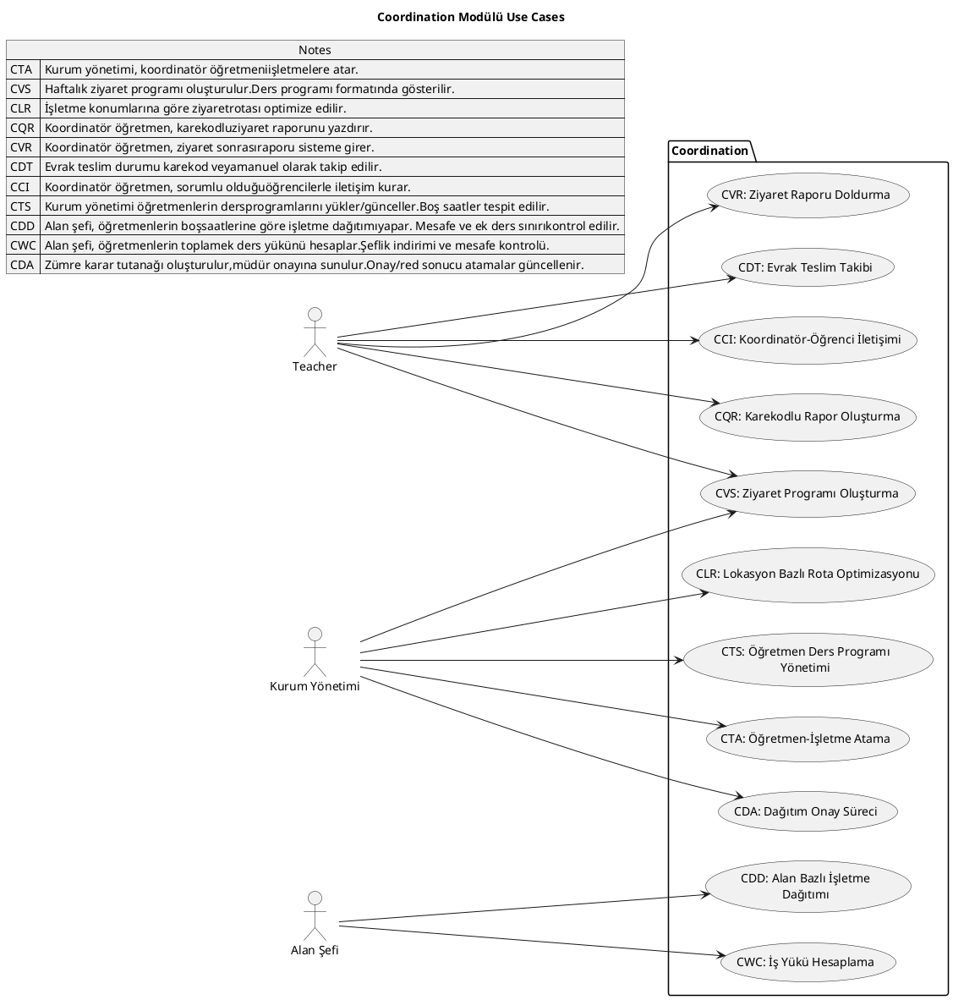
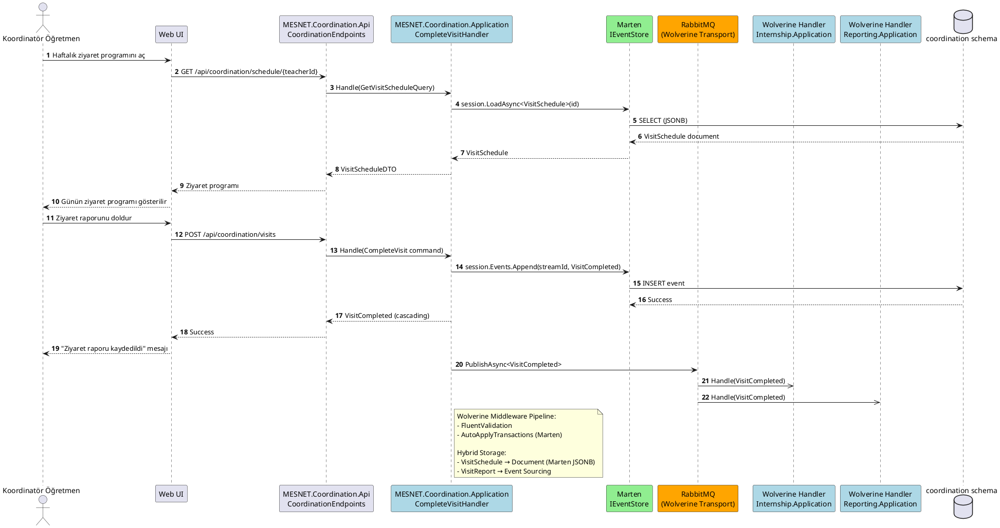
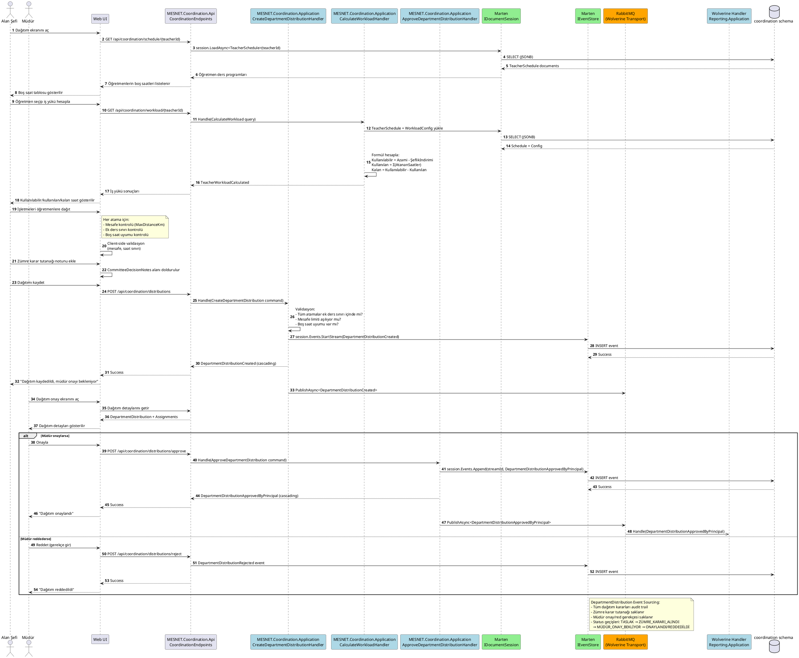

# Coordination Modülü

Öğretmen ziyaret programı, departman dağılımı, rapor ve evrak takibi.

:::warning Diyagramlar KAVRAMSAL — kodun bugünkü hâli değildir

Bu sayfadaki sınıf/sıra diyagramları modülün ilk tasarımını gösterir ve koddan **üretilmez**;
sapmayı yakalayan bir test de yoktur. Bilinen farklar:

- **API katmanı ASP.NET Minimal API'dir** (`MapGet`/`MapPost` → `bus.InvokeAsync`).
  `[WolverinePost]`/`[WolverineGet]` attribute'leri kodun **hiçbir yerinde kullanılmaz**;
  diyagramlardaki `POST`/`GET` etiketleri yalnız HTTP fiilini gösterir.
- **Enum'lar SmartEnum'dur** (`Name` İngilizce = serialize, `Slug` Türkçe = arayüz).
  Diyagramlardaki `MAZERETLI`, `ONAY_BEKLIYOR` gibi büyük harfli Türkçe değerler kodda
  bulunmaz.
- **Denetim aktörleri kimlik taşır, ad değil** (#139): `MarkedBy` → `MarkedById` (`Guid`).
  Ad okuma anında `UserNameView`'dan çözülür.
- Kiracı damgası, kapsam guard'ları ve onay zincirlerinin bugünkü hâli diyagramlarda yoktur.

Bir davranışın **bugünkü** kuralı için sırasıyla: `CLAUDE.md` → ilgili ADR →
[İş Kuralları](../architecture/business-rules.md) / [İzin Matrisi](../actors/permissions.md) →
kilitleyen test.
:::

## Class Diagram

```plantuml
@startuml ClassDiagram
left to right direction

package "MESNET.Coordination.Api" {
    class CoordinationEndpoints {
        +POST AssignTeacherToBusiness(command)
        +POST CreateVisitSchedule(command)
        +GET GetVisitSchedule(teacherId)
        +POST CompleteVisit(command)
        +POST GenerateReport(command)
        +POST DeliverDocument(command)
        +POST UploadTeacherSchedule(command)
        +POST CreateDepartmentDistribution(command)
        +POST ApproveDepartmentDistribution(command)
        +POST RejectDepartmentDistribution(command)
        +GET CalculateWorkload(teacherId)
        +GET GetTeacherSchedule(teacherId)
    }
}

package "MESNET.Coordination.Application" {
    class AssignTeacherHandler {
        +static TeacherAssignedToBusiness Handle(AssignTeacherToBusiness command, IDocumentSession session)
    }

    class CreateVisitScheduleHandler {
        +static VisitScheduleCreated Handle(CreateVisitSchedule command, IDocumentSession session)
    }

    class CompleteVisitHandler {
        +static VisitCompleted Handle(CompleteVisit command, IDocumentSession session)
    }

    class GenerateReportHandler {
        +static ReportGenerated Handle(GenerateReport command, IDocumentSession session)
    }

    class DeliverDocumentHandler {
        +static DocumentDelivered Handle(DeliverDocument command, IDocumentSession session)
    }

    class UploadTeacherScheduleHandler {
        +static TeacherScheduleUpdated Handle(UploadTeacherSchedule command, IDocumentSession session)
    }

    class CreateDepartmentDistributionHandler {
        +static DepartmentDistributionCreated Handle(CreateDepartmentDistribution command, IDocumentSession session)
    }

    class ApproveDepartmentDistributionHandler {
        +static DepartmentDistributionApprovedByPrincipal Handle(ApproveDepartmentDistribution command, IDocumentSession session)
    }

    class RejectDepartmentDistributionHandler {
        +static DepartmentDistributionRejected Handle(RejectDepartmentDistribution command, IDocumentSession session)
    }

    class CalculateWorkloadHandler {
        +static TeacherWorkloadCalculated Handle(CalculateWorkload query, IDocumentSession session)
    }

    note "CalculateWorkloadHandler:\nDers programı, atanan işletmeler,\nmesafe ve WorkloadConfig'e göre\nek ders sınırı kontrolü yapar.\n\nFormül:\nKullanılabilir = Azami - ŞeflikIndirimi\nKullanılan = Σ(AtananSaatler)\nKalan = Kullanılabilir - Kullanılan" as WorkloadNote
    CalculateWorkloadHandler .. WorkloadNote
}

package "MESNET.Coordination.Application\n«Event Consumers»" {
    class HandleStudentTransferredHandler {
        +Handle(StudentTransferred event, IDocumentSession session)
    }

    class HandleContractTerminatedHandler {
        +Handle(ContractTerminated event, IDocumentSession session)
    }

    note "Cross-module event consumer'lar.\nÖğrenci transfer veya fesih\ndurumunda öğretmen-işletme\natamasını günceller." as ConsumerNote
    HandleStudentTransferredHandler .. ConsumerNote
}

package "MESNET.Coordination.Core" {
    class VisitSchedule <<AggregateRoot>> {
        +Guid Id
        +Guid TeacherId
        +Guid InstitutionId
        +List<ScheduleSlot> Slots
        +DateTime WeekStartDate
        +ScheduleStatus Status
    }

    class ScheduleSlot <<Value Object>> {
        +DayOfWeek Day
        +TimeSpan StartTime
        +TimeSpan EndTime
        +Guid BusinessId
        +string BusinessName
        +Location BusinessLocation
    }

    class VisitReport <<AggregateRoot>> {
        +Guid Id
        +Guid VisitScheduleId
        +Guid TeacherId
        +Guid BusinessId
        +DateTime VisitDate
        +string Notes
        +ReportStatus Status
        +string QrCode
    }

    class TeacherAssignment {
        +Guid Id
        +Guid TeacherId
        +Guid BusinessId
        +DateTime AssignedAt
    }

    class DocumentDelivery {
        +Guid Id
        +Guid VisitReportId
        +DeliveryMethod Method
        +DateTime DeliveredAt
        +string QrCode
    }

    class Location <<Value Object>> {
        +double Latitude
        +double Longitude
    }

    class TeacherSchedule <<Document>> {
        +Guid Id
        +Guid TeacherId
        +Guid InstitutionId
        +string Semester
        +List<ScheduleEntry> Entries
        +int TotalWeeklyHours
        +int AvailableHours
        +DateTime UploadedAt
    }

    class ScheduleEntry <<Value Object>> {
        +DayOfWeek Day
        +int Period
        +string? SubjectName
        +bool IsAvailableForVisit
    }

    class DepartmentDistribution <<AggregateRoot>> {
        +Guid Id
        +Guid InstitutionId
        +Guid DepartmentHeadId
        +string BranchCode
        +string Semester
        +List<TeacherBusinessAssignment> Assignments
        +DistributionStatus Status
        +string? CommitteeDecisionNotes
        +string? PrincipalApprovalNote
        +DateTime CreatedAt
        +DateTime? ApprovedAt
    }

    class TeacherBusinessAssignment <<Value Object>> {
        +Guid TeacherId
        +string TeacherName
        +Guid BusinessId
        +string BusinessName
        +double DistanceKm
        +int AssignedHours
        +int StudentCount
    }

    class WorkloadConfig <<Document>> {
        +Guid Id
        +Guid InstitutionId
        +int MaxExtraLessonHoursPerWeek
        +int DepartmentHeadReductionHours
        +double MaxDistanceKm
        +int LessonDurationMinutes
        +string Semester
        +DateTime UpdatedAt
    }

    enum ScheduleStatus <<Enum>> {
        #TASLAK
        #AKTIF
        #TAMAMLANDI
    }

    enum ReportStatus <<Enum>> {
        #OLUSTURULDU
        #YAZDIRILDI
        #TESLIM_EDILDI
    }

    enum DeliveryMethod <<Enum>> {
        #KAREKOD
        #MANUEL
    }

    enum DistributionStatus <<Enum>> {
        #TASLAK
        #ZUMRE_KARARI_ALINDI
        #MUDUR_ONAY_BEKLIYOR
        #ONAYLANDI
        #REDDEDILDI
    }

    note "ScheduleEntry.Period: 1-8 arası\nders saati numarası.\nSubjectName null ise boş saat\n(ziyaret için uygun).\n\nDepartmentDistribution:\nAlan şefi dağıtım yapar →\nZümre karar tutanağı eklenir →\nMüdür onaylar/reddeder.\nEvent sourcing ile audit trail." as CoreNote
    DepartmentDistribution .. CoreNote
}

package "MESNET.Coordination.Shared" {
    class TeacherAssignedToBusiness {
        +Guid TeacherId
        +Guid BusinessId
        +DateTime AssignedAt
    }

    class VisitScheduleCreated {
        +Guid ScheduleId
        +Guid TeacherId
        +DateTime WeekStartDate
    }

    class VisitCompleted {
        +Guid VisitReportId
        +Guid TeacherId
        +Guid BusinessId
        +DateTime VisitDate
    }

    class ReportGenerated {
        +Guid VisitReportId
        +string QrCode
    }

    class DocumentDelivered {
        +Guid DocumentDeliveryId
        +Guid VisitReportId
        +DeliveryMethod Method
    }

    class DepartmentDistributionCreated {
        +Guid DistributionId
        +Guid InstitutionId
        +string BranchCode
        +int AssignmentCount
    }

    class DepartmentDistributionApprovedByPrincipal {
        +Guid DistributionId
        +string ApprovedBy
        +DateTime ApprovedAt
    }

    class DepartmentDistributionRejected {
        +Guid DistributionId
        +string RejectedBy
        +string Reason
    }

    class TeacherScheduleUpdated {
        +Guid TeacherId
        +Guid InstitutionId
        +int AvailableHours
    }

    class TeacherWorkloadCalculated {
        +Guid TeacherId
        +int TotalHours
        +int AvailableHours
        +int UsedHours
    }
}

package "MESNET.Coordination.Persistence" {
    class CoordinationMartenConfig <<IConfigureMarten>> {
        +void Configure(StoreOptions options)
    }

    note "Schema: coordination\nVisitSchedule → Document Storage\nVisitReport → Event Sourcing\nTeacherSchedule → Document Storage\nDepartmentDistribution → Event Sourcing\n  (onay zinciri audit trail)\nWorkloadConfig → Document Storage\n\nLessonDuration: 60 dk\n(MEB Yönetmeliği Madde 9/3)" as PersistenceNote
    CoordinationMartenConfig .. PersistenceNote
}

' Domain Relationships
VisitSchedule --> ScheduleSlot : has many
VisitSchedule --> ScheduleStatus : enum
ScheduleSlot --> Location : has one
VisitReport --> ReportStatus : enum
DocumentDelivery --> DeliveryMethod : enum
DocumentDelivery --> VisitReport : belongs to
TeacherSchedule --> ScheduleEntry : has many
DepartmentDistribution --> TeacherBusinessAssignment : has many
DepartmentDistribution --> DistributionStatus : enum

' API -> Handler (existing)
CoordinationEndpoints --> AssignTeacherHandler : Wolverine InvokeAsync
CoordinationEndpoints --> CreateVisitScheduleHandler : Wolverine InvokeAsync
CoordinationEndpoints --> CompleteVisitHandler : Wolverine InvokeAsync
CoordinationEndpoints --> GenerateReportHandler : Wolverine InvokeAsync
CoordinationEndpoints --> DeliverDocumentHandler : Wolverine InvokeAsync

' API -> Handler (new)
CoordinationEndpoints --> UploadTeacherScheduleHandler : Wolverine InvokeAsync
CoordinationEndpoints --> CreateDepartmentDistributionHandler : Wolverine InvokeAsync
CoordinationEndpoints --> ApproveDepartmentDistributionHandler : Wolverine InvokeAsync
CoordinationEndpoints --> RejectDepartmentDistributionHandler : Wolverine InvokeAsync
CoordinationEndpoints --> CalculateWorkloadHandler : Wolverine InvokeAsync

' Handler -> Events (cascading, existing)
AssignTeacherHandler --> TeacherAssignedToBusiness : returns (cascading)
CreateVisitScheduleHandler --> VisitScheduleCreated : returns (cascading)
CompleteVisitHandler --> VisitCompleted : returns (cascading)
GenerateReportHandler --> ReportGenerated : returns (cascading)
DeliverDocumentHandler --> DocumentDelivered : returns (cascading)

' Handler -> Events (cascading, new)
UploadTeacherScheduleHandler --> TeacherScheduleUpdated : returns (cascading)
CreateDepartmentDistributionHandler --> DepartmentDistributionCreated : returns (cascading)
ApproveDepartmentDistributionHandler --> DepartmentDistributionApprovedByPrincipal : returns (cascading)
RejectDepartmentDistributionHandler --> DepartmentDistributionRejected : returns (cascading)
CalculateWorkloadHandler --> TeacherWorkloadCalculated : returns (cascading)

' Cross-module event consumers
HandleStudentTransferredHandler ..> TeacherAssignment : updates
HandleContractTerminatedHandler ..> TeacherAssignment : updates

@enduml
```

## Use Cases

## Sequence Diagrams

### Ziyaret Tamamla (CompleteVisit)

### Departman Dağıtım (DepartmentDistribution)

