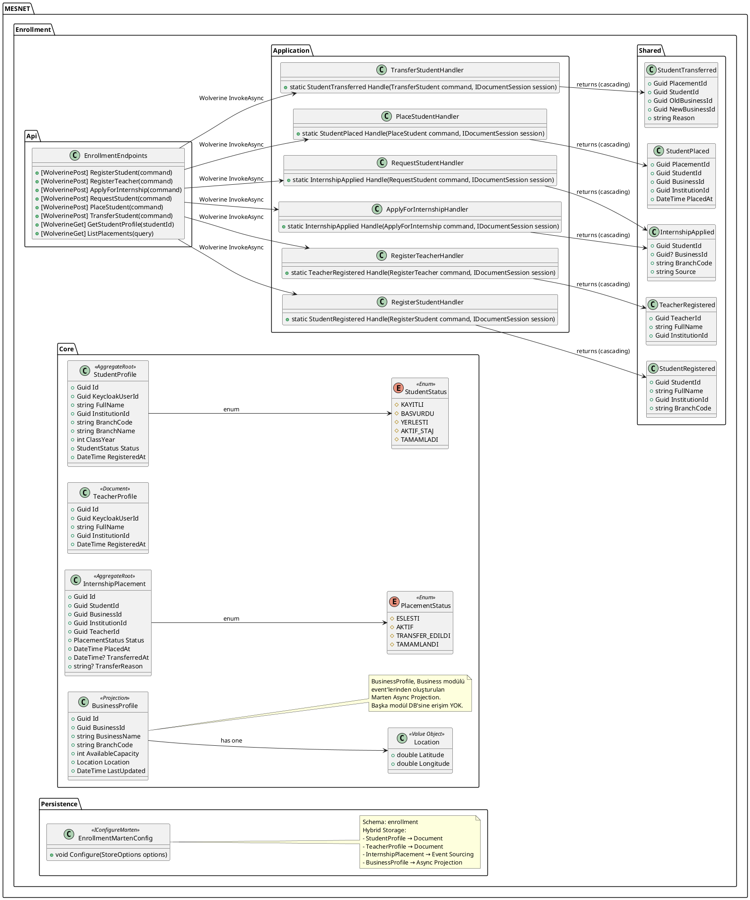
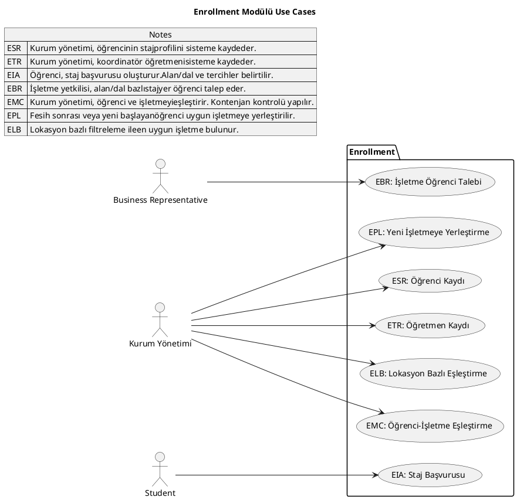
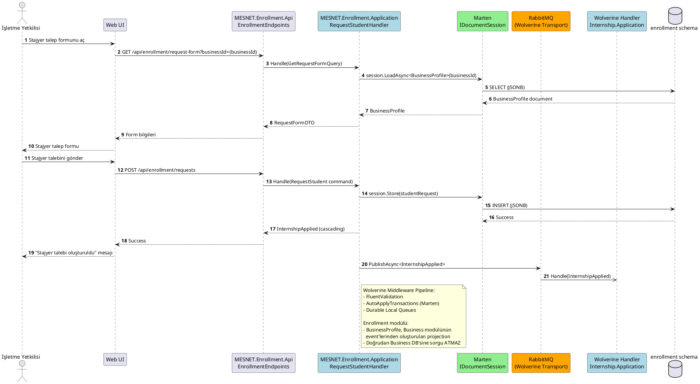

# Enrollment Modülü

Öğrenci ve öğretmen kaydı, işletmeye yerleştirme, başvuru süreçleri.

## Class Diagram

## Use Cases

## Sequence Diagrams

### Stajyer Öğrenci Talebi (RequestInternStudent)

