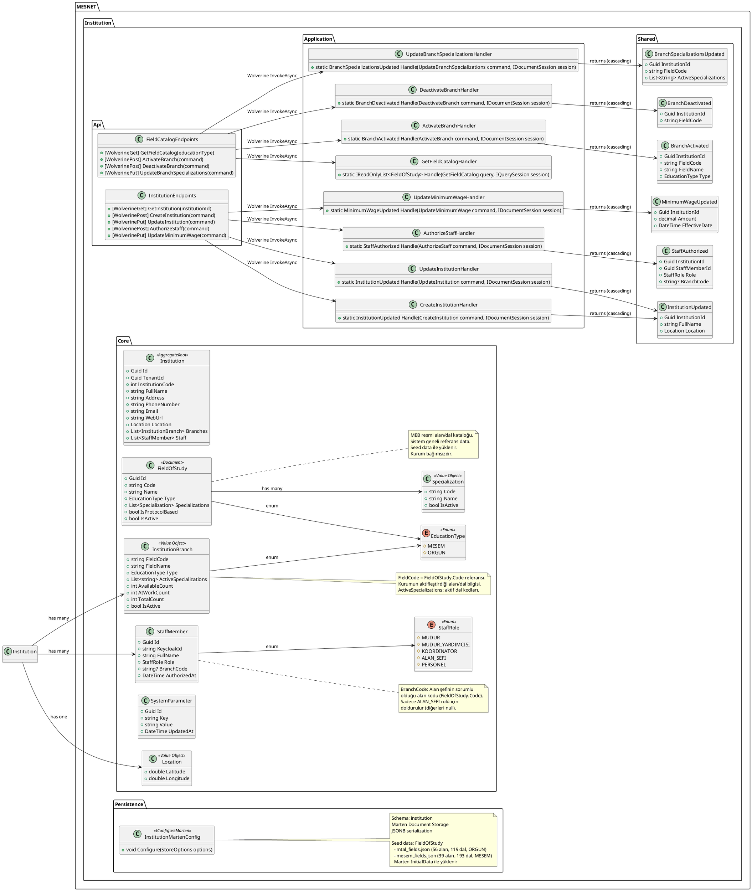
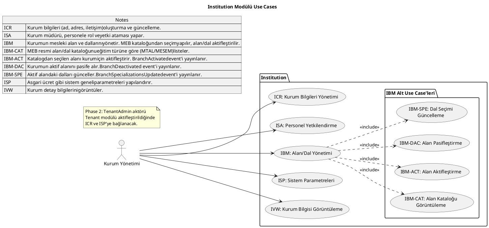
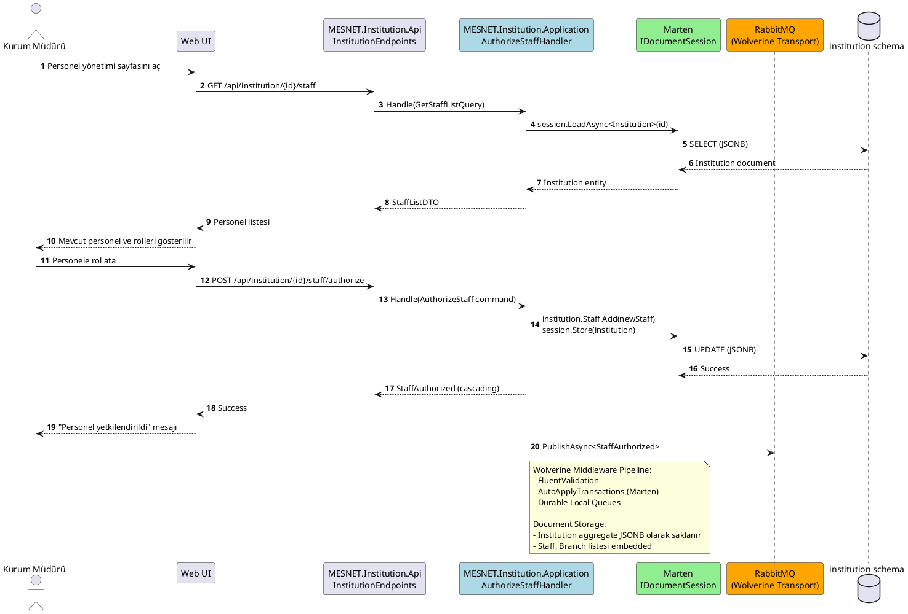

# Institution Modülü

Kurum bilgileri, personel yönetimi, alan/dal tanımları, parametreler.

## Class Diagram

```plantuml
@startuml ClassDiagram
left to right direction

package "MESNET.Institution.Api" {
    class InstitutionEndpoints {
        +[WolverineGet] GetInstitution(institutionId)
        +[WolverinePost] CreateInstitution(command)
        +[WolverinePut] UpdateInstitution(command)
        +[WolverinePost] AuthorizeStaff(command)
        +[WolverinePut] UpdateMinimumWage(command)
    }

    class FieldCatalogEndpoints {
        +[WolverineGet] GetFieldCatalog(educationType)
        +[WolverinePost] ActivateBranch(command)
        +[WolverinePost] DeactivateBranch(command)
        +[WolverinePut] UpdateBranchSpecializations(command)
    }
}

package "MESNET.Institution.Application" {
    class CreateInstitutionHandler {
        +static InstitutionUpdated Handle(CreateInstitution command, IDocumentSession session)
    }

    class UpdateInstitutionHandler {
        +static InstitutionUpdated Handle(UpdateInstitution command, IDocumentSession session)
    }

    class AuthorizeStaffHandler {
        +static StaffAuthorized Handle(AuthorizeStaff command, IDocumentSession session)
    }

    class UpdateMinimumWageHandler {
        +static MinimumWageUpdated Handle(UpdateMinimumWage command, IDocumentSession session)
    }

    class GetFieldCatalogHandler {
        +static IReadOnlyList<FieldOfStudy> Handle(GetFieldCatalog query, IQuerySession session)
    }

    class ActivateBranchHandler {
        +static BranchActivated Handle(ActivateBranch command, IDocumentSession session)
    }

    class DeactivateBranchHandler {
        +static BranchDeactivated Handle(DeactivateBranch command, IDocumentSession session)
    }

    class UpdateBranchSpecializationsHandler {
        +static BranchSpecializationsUpdated Handle(UpdateBranchSpecializations command, IDocumentSession session)
    }
}

package "MESNET.Institution.Core" {
    class Institution <<AggregateRoot>> {
        +Guid Id
        +Guid TenantId
        +int InstitutionCode
        +string FullName
        +string Address
        +string PhoneNumber
        +string Email
        +string WebUrl
        +Location Location
        +List<InstitutionBranch> Branches
        +List<StaffMember> Staff
    }

    class FieldOfStudy <<Document>> {
        +Guid Id
        +string Code
        +string Name
        +EducationType Type
        +List<Specialization> Specializations
        +bool IsProtocolBased
        +bool IsActive
    }

    note "MEB resmi alan/dal kataloğu.\nSistem geneli referans data.\nSeed data ile yüklenir.\nKurum bağımsızdır." as FieldNote
    FieldOfStudy .. FieldNote

    class Specialization <<Value Object>> {
        +string Code
        +string Name
        +bool IsActive
    }

    class InstitutionBranch <<Value Object>> {
        +string FieldCode
        +string FieldName
        +EducationType Type
        +List<string> ActiveSpecializations
        +int AvailableCount
        +int AtWorkCount
        +int TotalCount
        +bool IsActive
    }

    note "FieldCode = FieldOfStudy.Code referansı.\nKurumun aktifleştirdiği alan/dal bilgisi.\nActiveSpecializations: aktif dal kodları." as BranchNote
    InstitutionBranch .. BranchNote

    class StaffMember {
        +Guid Id
        +string KeycloakId
        +string FullName
        +StaffRole Role
        +string? BranchCode
        +DateTime AuthorizedAt
    }

    class SystemParameter {
        +Guid Id
        +string Key
        +string Value
        +DateTime UpdatedAt
    }

    class Location <<Value Object>> {
        +double Latitude
        +double Longitude
    }

    enum EducationType <<Enum>> {
        #MESEM
        #ORGUN
    }

    enum StaffRole <<Enum>> {
        #MUDUR
        #MUDUR_YARDIMCISI
        #KOORDINATOR
        #ALAN_SEFI
        #PERSONEL
    }

    note "BranchCode: Alan şefinin sorumlu\nolduğu alan kodu (FieldOfStudy.Code).\nSadece ALAN_SEFI rolü için\ndoldurulur (diğerleri null)." as StaffNote
    StaffMember .. StaffNote
}

package "MESNET.Institution.Shared" {
    class InstitutionUpdated {
        +Guid InstitutionId
        +string FullName
        +Location Location
    }

    class StaffAuthorized {
        +Guid InstitutionId
        +Guid StaffMemberId
        +StaffRole Role
        +string? BranchCode
    }

    class MinimumWageUpdated {
        +Guid InstitutionId
        +decimal Amount
        +DateTime EffectiveDate
    }

    class BranchActivated {
        +Guid InstitutionId
        +string FieldCode
        +string FieldName
        +EducationType Type
    }

    class BranchDeactivated {
        +Guid InstitutionId
        +string FieldCode
    }

    class BranchSpecializationsUpdated {
        +Guid InstitutionId
        +string FieldCode
        +List<string> ActiveSpecializations
    }
}

package "MESNET.Institution.Persistence" {
    class InstitutionMartenConfig <<IConfigureMarten>> {
        +void Configure(StoreOptions options)
    }

    note "Schema: institution\nMarten Document Storage\nJSONB serialization\n\nSeed data: FieldOfStudy\n  - mtal_fields.json (56 alan, 119 dal, ORGUN)\n  - mesem_fields.json (39 alan, 193 dal, MESEM)\n  Marten InitialData ile yüklenir" as PersistenceNote
    InstitutionMartenConfig .. PersistenceNote
}

' Domain Relationships
Institution --> InstitutionBranch : has many
Institution --> StaffMember : has many
Institution --> Location : has one
InstitutionBranch --> EducationType : enum
FieldOfStudy --> Specialization : has many
FieldOfStudy --> EducationType : enum
StaffMember --> StaffRole : enum

' API -> Handler (Institution)
InstitutionEndpoints --> CreateInstitutionHandler : Wolverine InvokeAsync
InstitutionEndpoints --> UpdateInstitutionHandler : Wolverine InvokeAsync
InstitutionEndpoints --> AuthorizeStaffHandler : Wolverine InvokeAsync
InstitutionEndpoints --> UpdateMinimumWageHandler : Wolverine InvokeAsync

' API -> Handler (Field Catalog & Branch)
FieldCatalogEndpoints --> GetFieldCatalogHandler : Wolverine InvokeAsync
FieldCatalogEndpoints --> ActivateBranchHandler : Wolverine InvokeAsync
FieldCatalogEndpoints --> DeactivateBranchHandler : Wolverine InvokeAsync
FieldCatalogEndpoints --> UpdateBranchSpecializationsHandler : Wolverine InvokeAsync

' Handler -> Events (cascading)
CreateInstitutionHandler --> InstitutionUpdated : returns (cascading)
UpdateInstitutionHandler --> InstitutionUpdated : returns (cascading)
AuthorizeStaffHandler --> StaffAuthorized : returns (cascading)
UpdateMinimumWageHandler --> MinimumWageUpdated : returns (cascading)
ActivateBranchHandler --> BranchActivated : returns (cascading)
DeactivateBranchHandler --> BranchDeactivated : returns (cascading)
UpdateBranchSpecializationsHandler --> BranchSpecializationsUpdated : returns (cascading)

@enduml
```

## Use Cases

```plantuml
@startuml InstitutionUseCasesDiagram
title Institution Modülü Use Cases
left to right direction

:Kurum Yönetimi: as InstAdmin

package Institution {
    usecase "ICR: Kurum Bilgileri Yönetimi" as ICR
    usecase "ISA: Personel Yetkilendirme" as ISA
    usecase "IBM: Alan/Dal Yönetimi" as IBM
    usecase "ISP: Sistem Parametreleri" as ISP
    usecase "IVW: Kurum Bilgisi Görüntüleme" as IVW

    package "IBM Alt Use Case'leri" {
        usecase "IBM-CAT: Alan Kataloğu\nGörüntüleme" as IBM_CAT
        usecase "IBM-ACT: Alan Aktifleştirme" as IBM_ACT
        usecase "IBM-DAC: Alan Pasifleştirme" as IBM_DAC
        usecase "IBM-SPE: Dal Seçimi\nGüncelleme" as IBM_SPE
    }
}

note "Phase 2: TenantAdmin aktörü\nTenant modülü aktifleştirildiğinde\nICR ve ISP'ye bağlanacak." as Phase2Note

InstAdmin --> ICR
InstAdmin --> ISA
InstAdmin --> IBM
InstAdmin --> ISP
InstAdmin --> IVW

IBM ..> IBM_CAT : <<include>>
IBM ..> IBM_ACT : <<include>>
IBM ..> IBM_DAC : <<include>>
IBM ..> IBM_SPE : <<include>>

json Notes {
    "ICR": "Kurum bilgileri (ad, adres, iletişim)\noluşturma ve güncelleme.",
    "ISA": "Kurum müdürü, personele rol ve\nyetki ataması yapar.",
    "IBM": "Kurumun mesleki alan ve dallarını\nyönetir. MEB kataloğundan seçim\nyapılır, alan/dal aktifleştirilir.",
    "IBM-CAT": "MEB resmi alan/dal kataloğunu\neğitim türüne göre (MTAL/MESEM)\nlisteler.",
    "IBM-ACT": "Katalogdan seçilen alanı kurum\niçin aktifleştirir. BranchActivated\nevent'i yayınlanır.",
    "IBM-DAC": "Kurumun aktif alanını pasife alır.\nBranchDeactivated event'i yayınlanır.",
    "IBM-SPE": "Aktif alandaki dalları günceller.\nBranchSpecializationsUpdated\nevent'i yayınlanır.",
    "ISP": "Asgari ücret gibi sistem geneli\nparametreleri yapılandırır.",
    "IVW": "Kurum detay bilgilerini\ngörüntüler."
}

@enduml
```

## Sequence Diagrams

### Personel Yetkilendirme (AuthorizeStaff)

```plantuml
@startuml ISASequenceDiagram
autonumber

actor "Kurum Müdürü" as InstAdmin
participant "Web UI" as UI
participant "MESNET.Institution.Api\nInstitutionEndpoints" as API
participant "MESNET.Institution.Application\nAuthorizeStaffHandler" as Handler #LightBlue
participant "Marten\nIDocumentSession" as Marten #LightGreen
participant "RabbitMQ\n(Wolverine Transport)" as MessageBroker #Orange
database "institution schema" as DB

' Personel listesini getirme
InstAdmin -> UI: Personel yönetimi sayfasını aç
UI -> API: GET /api/institution/{id}/staff
API -> Handler: Handle(GetStaffListQuery)
Handler -> Marten: session.LoadAsync<Institution>(id)
Marten -> DB: SELECT (JSONB)
DB --> Marten: Institution document
Marten --> Handler: Institution entity
Handler --> API: StaffListDTO
API --> UI: Personel listesi
UI --> InstAdmin: Mevcut personel ve rolleri gösterilir

' Personel yetkilendirme
InstAdmin -> UI: Personele rol ata
UI -> API: POST /api/institution/{id}/staff/authorize
API -> Handler: Handle(AuthorizeStaff command)
Handler -> Marten: institution.Staff.Add(newStaff)\nsession.Store(institution)
Marten -> DB: UPDATE (JSONB)
DB --> Marten: Success

' Cascading message
Handler --> API: StaffAuthorized (cascading)
API --> UI: Success
UI --> InstAdmin: "Personel yetkilendirildi" mesajı

' Asenkron event dağıtımı
Handler -> MessageBroker: PublishAsync<StaffAuthorized>

note right of Handler
  Wolverine Middleware Pipeline:
  - FluentValidation
  - AutoApplyTransactions (Marten)
  - Durable Local Queues

  Document Storage:
  - Institution aggregate JSONB olarak saklanır
  - Staff, Branch listesi embedded
end note

@enduml
```
