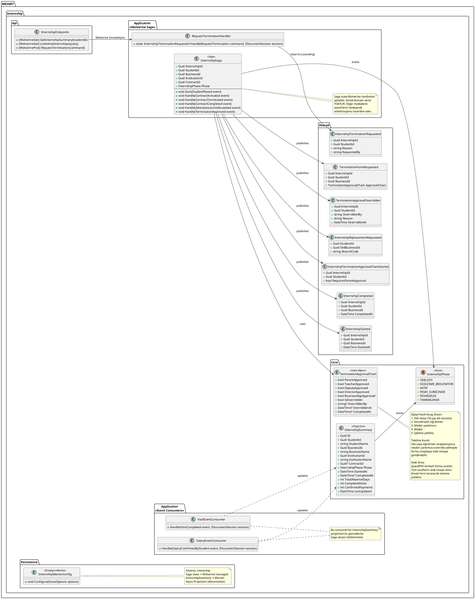
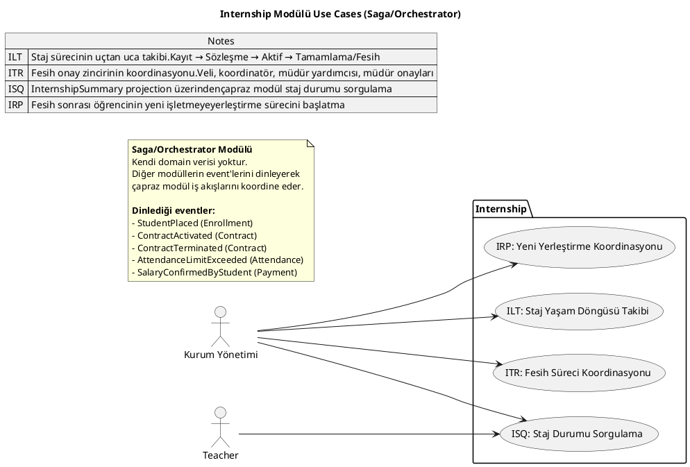
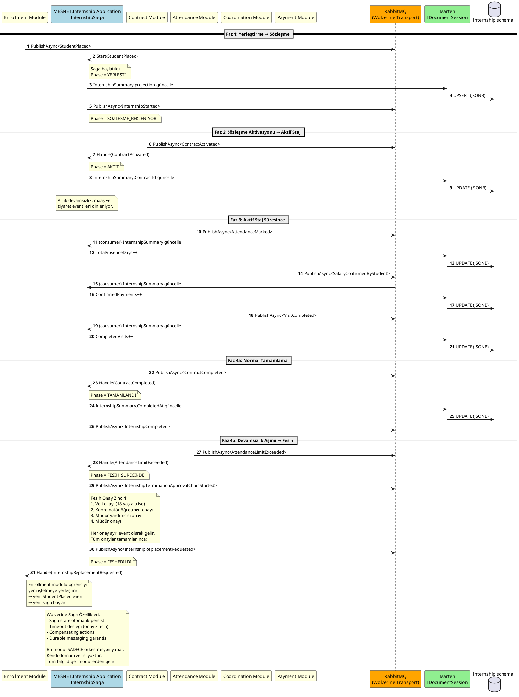

# Internship Modülü

Staj yaşam döngüsü orkestrasyonu (Wolverine Saga). Kendi domain verisi yoktur, diğer modülleri koordine eder.

## Class Diagram

## Use Cases

## Sequence Diagrams

### Staj Yaşam Döngüsü (InternshipLifecycle)

