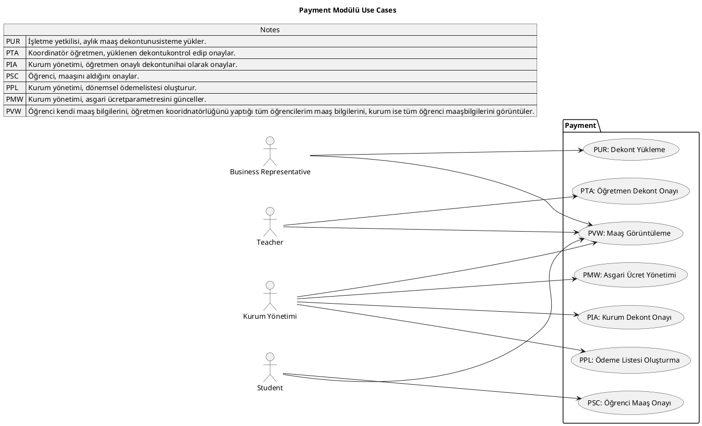
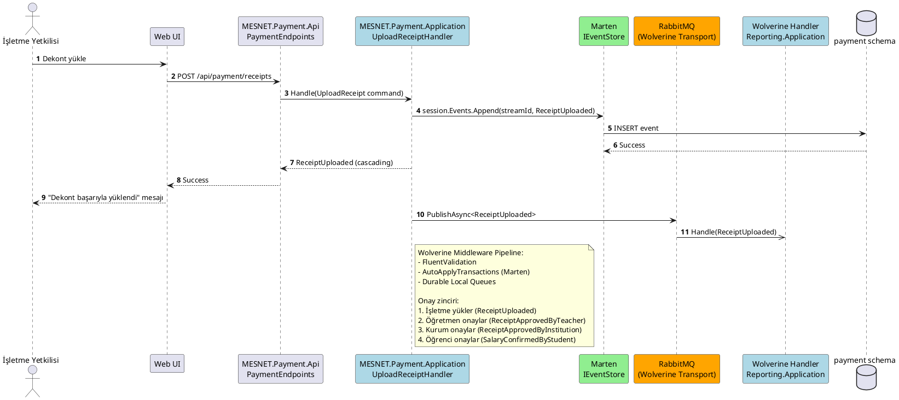
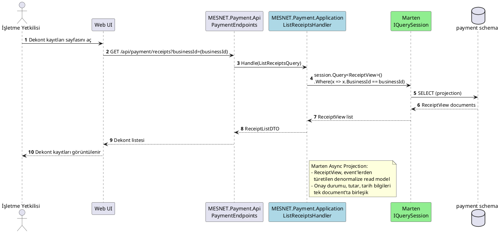

# Payment Modülü

Maaş hesaplama, dekont yükleme, onay zinciri.

## Class Diagram

```plantuml
@startuml ClassDiagram
left to right direction

package "MESNET.Payment.Api" {
    class PaymentEndpoints {
        +[WolverinePost] UploadReceipt(command)
        +[WolverinePost] ApproveReceiptByTeacher(command)
        +[WolverinePost] ApproveReceiptByInstitution(command)
        +[WolverinePost] RejectReceipt(command)
        +[WolverinePost] ConfirmSalary(command)
        +[WolverinePost] GeneratePaymentList(command)
        +[WolverineGet] GetReceipt(receiptId)
        +[WolverineGet] ListReceipts(query)
    }
}

package "MESNET.Payment.Application" {
    class UploadReceiptHandler {
        +static ReceiptUploaded Handle(UploadReceipt command, IDocumentSession session)
    }

    class ApproveReceiptByTeacherHandler {
        +static ReceiptApprovedByTeacher Handle(ApproveReceiptByTeacher command, IDocumentSession session)
    }

    class ApproveReceiptByInstitutionHandler {
        +static ReceiptApprovedByInstitution Handle(ApproveReceiptByInstitution command, IDocumentSession session)
    }

    class RejectReceiptHandler {
        +static ReceiptRejected Handle(RejectReceipt command, IDocumentSession session)
    }

    class ConfirmSalaryHandler {
        +static SalaryConfirmedByStudent Handle(ConfirmSalary command, IDocumentSession session)
    }

    class GeneratePaymentListHandler {
        +static PaymentListGenerated Handle(GeneratePaymentList command, IDocumentSession session)
    }

    class CalculateSalaryHandler {
        +static SalaryCalculated Handle(AttendanceMarked event, IDocumentSession session)
    }

    note "CalculateSalaryHandler,\nAttendance modülünden gelen\nAttendanceMarked event'ini\ndinleyerek maaş hesaplar.\n\n3308 Madde 25 Formül:\nTabanÜcret = NetAsgarıÜcret × Oran\n  ≥20 personel → %30\n  <20 personel → %15\n  MEM 12. sınıf → %50\n\nKesinti = (TabanÜcret/30) × DevamsızGün\nÖdenen = TabanÜcret - Kesinti\nDevletKatkısı = Ödenen × DevletOranı\nİşverenPayı = Ödenen - DevletKatkısı" as CalcNote
    CalculateSalaryHandler .. CalcNote
}

package "MESNET.Payment.Core" {
    class FeeReceipt <<AggregateRoot>> {
        +Guid Id
        +Guid StudentId
        +Guid BusinessId
        +Guid InstitutionId
        +string Month
        +decimal Amount
        +string ReceiptUrl
        +ReceiptStatus Status
        +string UploadedBy
        +DateTime UploadedAt
        +string? TeacherApprovedBy
        +DateTime? TeacherApprovedAt
        +string? InstitutionApprovedBy
        +DateTime? InstitutionApprovedAt
        +string? RejectedBy
        +string? RejectionReason
    }

    class SalaryPeriod <<AggregateRoot>> {
        +Guid Id
        +Guid StudentId
        +Guid BusinessId
        +Guid InstitutionId
        +string Month
        +decimal BaseWage
        +int WorkingDays
        +int UnexcusedAbsenceDays
        +decimal DeductionAmount
        +decimal GrossAmount
        +decimal NetAmount
        +decimal GovernmentContribution
        +decimal EmployerPayment
        +SalaryStatus Status
        +DateTime CalculatedAt
        +DateTime? PaidAt
    }

    class ReceiptView <<Projection>> {
        +Guid Id
        +Guid StudentId
        +string StudentName
        +Guid BusinessId
        +string BusinessName
        +string Month
        +decimal Amount
        +ReceiptStatus Status
        +DateTime LastUpdated
    }

    enum ReceiptStatus <<Enum>> {
        #YUKLENDI
        #OGRETMEN_ONAYLADI
        #KURUM_ONAYLADI
        #REDDEDILDI
        #OGRENCI_ONAYLADI
    }

    enum SalaryStatus <<Enum>> {
        #HESAPLANDI
        #DEKONT_BEKLENIYOR
        #ONAYLANDI
        #OGRENCI_ONAYLADI
    }

    class SalaryCalculationConfig <<Document>> {
        +Guid Id
        +Guid InstitutionId
        +decimal MinimumWage
        +int PersonnelThreshold
        +decimal LargeBusinessRate
        +decimal SmallBusinessRate
        +decimal MEM12thGradeRate
        +decimal GovContribSmallNonMEM
        +decimal GovContribLargeNonMEM
        +decimal GovContribMEM
        +DateTime EffectiveFrom
        +DateTime? EffectiveTo
        +string UpdatedBy
    }

    enum BusinessSizeCategory <<Enum>> {
        #BUYUK_ISLETME
        #KUCUK_ISLETME
    }

    enum GovernmentContributionType <<Enum>> {
        #MEM_OGRENCISI
        #MEM_DISI_BUYUK
        #MEM_DISI_KUCUK
        #KAMU_KURUMU
    }
}

package "MESNET.Payment.Shared" {
    class SalaryCalculated {
        +Guid SalaryPeriodId
        +Guid StudentId
        +string Month
        +decimal Amount
    }

    class ReceiptUploaded {
        +Guid ReceiptId
        +Guid StudentId
        +Guid BusinessId
        +string Month
        +decimal Amount
    }

    class ReceiptApprovedByTeacher {
        +Guid ReceiptId
        +string ApprovedBy
        +DateTime ApprovedAt
    }

    class ReceiptApprovedByInstitution {
        +Guid ReceiptId
        +string ApprovedBy
        +DateTime ApprovedAt
    }

    class ReceiptRejected {
        +Guid ReceiptId
        +string RejectedBy
        +string Reason
    }

    class SalaryConfirmedByStudent {
        +Guid ReceiptId
        +Guid StudentId
        +DateTime ConfirmedAt
    }

    class PaymentListGenerated {
        +Guid InstitutionId
        +string Month
        +int StudentCount
        +decimal TotalAmount
    }
}

package "MESNET.Payment.Persistence" {
    class PaymentMartenConfig <<IConfigureMarten>> {
        +void Configure(StoreOptions options)
    }

    note "Schema: payment\nHybrid Storage:\n- FeeReceipt & SalaryPeriod → Event Sourcing\n- SalaryCalculationConfig → Document Storage\n- ReceiptView → Async Projection\n- Onay zinciri audit trail\n\n3308 Madde 25:\n- Stajyer ücretleri vergiden muaf\n- SGK primleri asgari ücretin %50'si\n  üzerinden Bakanlık bütçesinden\n- Ödeme her ayın 8'ine kadar\n- Dekont her ayın 25'ine kadar" as PersistenceNote
    PaymentMartenConfig .. PersistenceNote
}

' Domain Relationships
FeeReceipt --> ReceiptStatus : enum
SalaryPeriod --> SalaryStatus : enum
SalaryPeriod --> SalaryCalculationConfig : uses

' API -> Handler
PaymentEndpoints --> UploadReceiptHandler : Wolverine InvokeAsync
PaymentEndpoints --> ApproveReceiptByTeacherHandler : Wolverine InvokeAsync
PaymentEndpoints --> ApproveReceiptByInstitutionHandler : Wolverine InvokeAsync
PaymentEndpoints --> RejectReceiptHandler : Wolverine InvokeAsync
PaymentEndpoints --> ConfirmSalaryHandler : Wolverine InvokeAsync
PaymentEndpoints --> GeneratePaymentListHandler : Wolverine InvokeAsync

' Handler -> Events (cascading)
UploadReceiptHandler --> ReceiptUploaded : returns (cascading)
ApproveReceiptByTeacherHandler --> ReceiptApprovedByTeacher : returns (cascading)
ApproveReceiptByInstitutionHandler --> ReceiptApprovedByInstitution : returns (cascading)
RejectReceiptHandler --> ReceiptRejected : returns (cascading)
ConfirmSalaryHandler --> SalaryConfirmedByStudent : returns (cascading)
GeneratePaymentListHandler --> PaymentListGenerated : returns (cascading)

' Cross-module event consumer
CalculateSalaryHandler --> SalaryCalculated : returns (cascading)

@enduml
```

## Use Cases

```plantuml
@startuml PaymentUseCasesDiagram
title Payment Modülü Use Cases
left to right direction

:Business Representative: as BusRep
:Teacher: as Teacher
:Kurum Yönetimi: as InstAdmin
:Student: as Student

package Payment {
    usecase "PUR: Dekont Yükleme" as PUR
    usecase "PTA: Öğretmen Dekont Onayı" as PTA
    usecase "PIA: Kurum Dekont Onayı" as PIA
    usecase "PSC: Öğrenci Maaş Onayı" as PSC
    usecase "PPL: Ödeme Listesi Oluşturma" as PPL
    usecase "PMW: Asgari Ücret Yönetimi" as PMW
    usecase "PVW: Maaş Görüntüleme" as PVW
}

BusRep --> PUR
BusRep --> PVW
Teacher --> PTA
Teacher --> PVW
InstAdmin --> PIA
InstAdmin --> PPL
InstAdmin --> PMW
InstAdmin --> PVW
Student --> PSC
Student --> PVW

json Notes {
    "PUR": "İşletme yetkilisi, aylık maaş dekontunu\nsisteme yükler.",
    "PTA": "Koordinatör öğretmen, yüklenen dekontu\nkontrol edip onaylar.",
    "PIA": "Kurum yönetimi, öğretmen onaylı dekontu\nnihai olarak onaylar.",
    "PSC": "Öğrenci, maaşını aldığını onaylar.",
    "PPL": "Kurum yönetimi, dönemsel ödeme\nlistesi oluşturur.",
    "PMW": "Kurum yönetimi, asgari ücret\nparametresini günceller.",
    "PVW": "Öğrenci kendi maaş bilgilerini, öğretmen kooridnatörlüğünü yaptığı tüm öğrencilerim maaş bilgilerini, kurum ise tüm öğrenci maaş\nbilgilerini görüntüler."
}

@enduml
```

## Sequence Diagrams

### Dekont Yükle (UploadFeeRecord)

```plantuml
@startuml UFRSequenceDiagram
autonumber

actor "İşletme Yetkilisi" as BusRep
participant "Web UI" as UI
participant "MESNET.Payment.Api\nPaymentEndpoints" as API
participant "MESNET.Payment.Application\nUploadReceiptHandler" as Handler #LightBlue
participant "Marten\nIEventStore" as EventStore #LightGreen
participant "RabbitMQ\n(Wolverine Transport)" as MessageBroker #Orange
participant "Wolverine Handler\nReporting.Application" as ReportingHandler #LightBlue
database "payment schema" as DB

BusRep -> UI: Dekont yükle
UI -> API: POST /api/payment/receipts
API -> Handler: Handle(UploadReceipt command)

Handler -> EventStore: session.Events.Append(streamId, ReceiptUploaded)
EventStore -> DB: INSERT event
DB --> EventStore: Success

' Cascading message
Handler --> API: ReceiptUploaded (cascading)
API --> UI: Success
UI --> BusRep: "Dekont başarıyla yüklendi" mesajı

' Asenkron event dağıtımı
Handler -> MessageBroker: PublishAsync<ReceiptUploaded>
MessageBroker ->> ReportingHandler: Handle(ReceiptUploaded)

note right of Handler
  Wolverine Middleware Pipeline:
  - FluentValidation
  - AutoApplyTransactions (Marten)
  - Durable Local Queues

  Onay zinciri:
  1. İşletme yükler (ReceiptUploaded)
  2. Öğretmen onaylar (ReceiptApprovedByTeacher)
  3. Kurum onaylar (ReceiptApprovedByInstitution)
  4. Öğrenci onaylar (SalaryConfirmedByStudent)
end note

@enduml
```

### Dekont Listele (ListFeeRecords)

```plantuml
@startuml LFRSequenceDiagram
autonumber

actor "İşletme Yetkilisi" as BusRep
participant "Web UI" as UI
participant "MESNET.Payment.Api\nPaymentEndpoints" as API
participant "MESNET.Payment.Application\nListReceiptsHandler" as Handler #LightBlue
participant "Marten\nIQuerySession" as Marten #LightGreen
database "payment schema" as DB

BusRep -> UI: Dekont kayıtları sayfasını aç
UI -> API: GET /api/payment/receipts?businessId={businessId}
API -> Handler: Handle(ListReceiptsQuery)
Handler -> Marten: session.Query<ReceiptView>()\n.Where(x => x.BusinessId == businessId)
Marten -> DB: SELECT (projection)
DB --> Marten: ReceiptView documents
Marten --> Handler: ReceiptView list
Handler --> API: ReceiptListDTO
API --> UI: Dekont listesi
UI --> BusRep: Dekont kayıtları görüntülenir

note right of Handler
  Marten Async Projection:
  - ReceiptView, event'lerden
    türetilen denormalize read model
  - Onay durumu, tutar, tarih bilgileri
    tek document'ta birleşik
end note

@enduml
```
