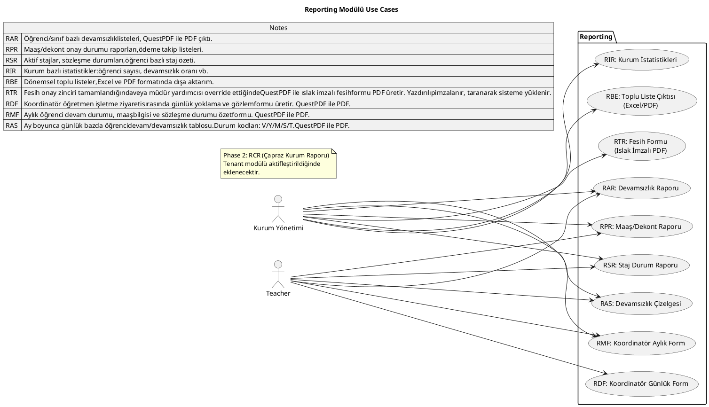
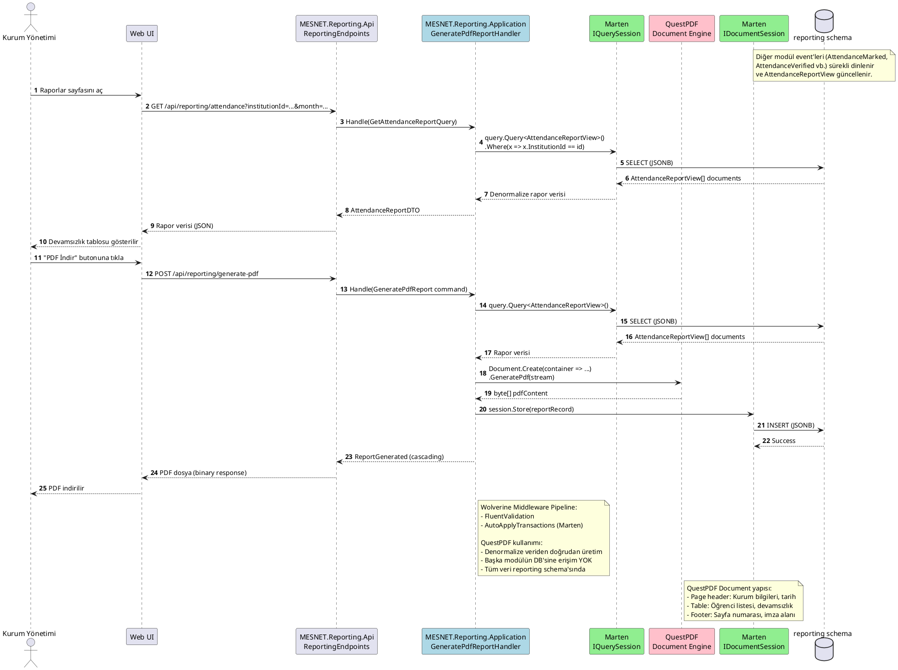

# Reporting Modülü

PDF rapor üretimi (QuestPDF), denormalize veri, tüm modül event'lerini dinler.

## Class Diagram

```plantuml
@startuml ClassDiagram
left to right direction

package "MESNET.Reporting.Api" {
    class ReportingEndpoints {
        +[WolverineGet] GetAttendanceReport(query)
        +[WolverineGet] GetPaymentReport(query)
        +[WolverineGet] GetInternshipStatusReport(query)
        +[WolverineGet] GetInstitutionStatistics(query)
        +[WolverinePost] GeneratePdfReport(command)
        +[WolverinePost] GenerateTerminationReport(command)
        +[WolverinePost] GenerateBulkExport(command)
        +[WolverinePost] GenerateCoordinatorDailyForm(command)
        +[WolverinePost] GenerateCoordinatorMonthlyForm(command)
        +[WolverinePost] GenerateAttendanceSheet(command)
    }
}

package "MESNET.Reporting.Application" {
    class GeneratePdfReportHandler {
        +static ReportGenerated Handle(GeneratePdfReport command, IDocumentSession session)
    }

    class GenerateBulkExportHandler {
        +static BulkExportGenerated Handle(GenerateBulkExport command, IDocumentSession session)
    }

    class GenerateTerminationReportHandler {
        +static TerminationReportGenerated Handle(GenerateTerminationReport command, IDocumentSession session)
    }

    class GenerateCoordinatorDailyFormHandler {
        +static ReportGenerated Handle(GenerateCoordinatorDailyForm command, IDocumentSession session)
    }

    class GenerateCoordinatorMonthlyFormHandler {
        +static ReportGenerated Handle(GenerateCoordinatorMonthlyForm command, IDocumentSession session)
    }

    class GenerateAttendanceSheetHandler {
        +static ReportGenerated Handle(GenerateAttendanceSheet command, IDocumentSession session)
    }

    note "Query handler'lar Marten\nIQuerySession ile doğrudan\ndenormalize document okur.\n\nGenerateTerminationReportHandler:\nQuestPDF ile fesih formu PDF üretir.\n\nGünlük Form: Ziyaret yoklaması,\nöğrenci bazlı devam/gözlem.\nAylık Form: Devam özeti, maaş,\nsözleşme durumu.\nDevamsızlık Çizelgesi: Gün bazlı\ndurum matrisi (V/Y/M/S/T)." as QueryNote
}

package "MESNET.Reporting.Application\n«Event Consumers»" {
    class AttendanceEventConsumer {
        +Handle(AttendanceMarked event, IDocumentSession session)
        +Handle(AttendanceVerified event, IDocumentSession session)
        +Handle(HealthReportAttached event, IDocumentSession session)
    }

    class PaymentEventConsumer {
        +Handle(ReceiptUploaded event, IDocumentSession session)
        +Handle(ReceiptApprovedByTeacher event, IDocumentSession session)
        +Handle(SalaryConfirmedByStudent event, IDocumentSession session)
    }

    class EnrollmentEventConsumer {
        +Handle(StudentRegistered event, IDocumentSession session)
        +Handle(StudentPlaced event, IDocumentSession session)
    }

    class ContractEventConsumer {
        +Handle(ContractActivated event, IDocumentSession session)
        +Handle(ContractTerminated event, IDocumentSession session)
        +Handle(ContractCompleted event, IDocumentSession session)
    }

    class InstitutionEventConsumer {
        +Handle(InstitutionUpdated event, IDocumentSession session)
        +Handle(StaffAuthorized event, IDocumentSession session)
    }

    class TerminationEventConsumer {
        +Handle(InternshipTerminationRequested event, IDocumentSession session)
        +Handle(InternshipTerminationApprovalChainStarted event, IDocumentSession session)
        +Handle(TerminationApprovalOverridden event, IDocumentSession session)
        +Handle(TerminationFormRequested event, IDocumentSession session)
        +Handle(ContractTerminated event, IDocumentSession session)
    }

    class CoordinationEventConsumer {
        +Handle(VisitCompleted event, IDocumentSession session)
        +Handle(TeacherAssignedToBusiness event, IDocumentSession session)
        +Handle(DepartmentDistributionApprovedByPrincipal event, IDocumentSession session)
    }
}

package "MESNET.Reporting.Core\n«Denormalized Read Models»" {
    class StudentReportView <<Document>> {
        +Guid Id
        +Guid StudentId
        +string FullName
        +Guid InstitutionId
        +string InstitutionName
        +Guid? BusinessId
        +string? BusinessName
        +string ContractStatus
        +int TotalAbsenceDays
        +int ApprovedPaymentCount
        +DateTime LastUpdated
    }

    class BusinessReportView <<Document>> {
        +Guid Id
        +Guid BusinessId
        +string BusinessName
        +int ActiveInternCount
        +int TotalCapacity
        +int CompletedInternCount
        +DateTime LastUpdated
    }

    class AttendanceReportView <<Document>> {
        +Guid Id
        +Guid StudentId
        +string StudentName
        +Guid InstitutionId
        +List<AbsenceRecord> Absences
        +int TotalAbsenceDays
        +bool LimitExceeded
        +DateTime LastUpdated
    }

    class PaymentReportView <<Document>> {
        +Guid Id
        +Guid StudentId
        +string StudentName
        +Guid InstitutionId
        +List<PaymentRecord> Payments
        +decimal TotalPaid
        +int PendingCount
        +DateTime LastUpdated
    }

    class InstitutionReportView <<Document>> {
        +Guid Id
        +Guid InstitutionId
        +string InstitutionName
        +int ActiveStudentCount
        +int ActiveBusinessCount
        +int TotalInternships
        +decimal AverageAbsenceRate
        +DateTime LastUpdated
    }

    class AbsenceRecord <<Value Object>> {
        +DateTime Date
        +string Reason
        +bool IsVerified
    }

    class PaymentRecord <<Value Object>> {
        +string Month
        +decimal Amount
        +string Status
        +DateTime? ApprovedAt
    }

    class TerminationReportView <<Document>> {
        +Guid Id
        +Guid InternshipId
        +Guid StudentId
        +string StudentName
        +string StudentClass
        +Guid BusinessId
        +string BusinessName
        +Guid InstitutionId
        +string InstitutionName
        +string TerminationReason
        +string TerminationReasonDetail
        +bool ParentApproved
        +bool TeacherApproved
        +bool DeputyApproved
        +bool DirectorApproved
        +bool BusinessRepApproved
        +bool IsOverridden
        +string? OverriddenBy
        +DateTime? FormGeneratedAt
        +string? SignedFormUrl
        +DateTime LastUpdated
    }

    class CoordinatorDailyFormView <<Document>> {
        +Guid Id
        +Guid TeacherId
        +string TeacherName
        +Guid BusinessId
        +string BusinessName
        +DateTime Date
        +int StudentCount
        +List<StudentDailyRecord> Students
        +string? Notes
        +DateTime LastUpdated
    }

    class StudentDailyRecord <<Value Object>> {
        +Guid StudentId
        +string StudentName
        +bool IsPresent
        +string? AbsenceType
        +string? Notes
    }

    class CoordinatorMonthlyFormView <<Document>> {
        +Guid Id
        +Guid TeacherId
        +string TeacherName
        +Guid BusinessId
        +string BusinessName
        +string Month
        +int TotalVisitDays
        +int TotalStudents
        +List<StudentMonthlyRecord> Students
        +decimal TotalSalaryPaid
        +DateTime LastUpdated
    }

    class StudentMonthlyRecord <<Value Object>> {
        +Guid StudentId
        +string StudentName
        +int PresentDays
        +int AbsentDays
        +decimal SalaryAmount
        +string ContractStatus
    }

    class AttendanceSheetView <<Document>> {
        +Guid Id
        +Guid InstitutionId
        +Guid BusinessId
        +string BusinessName
        +string Month
        +List<AttendanceSheetRow> Rows
        +DateTime LastUpdated
    }

    class AttendanceSheetRow <<Value Object>> {
        +Guid StudentId
        +string StudentName
        +List<DayStatus> Days
    }

    class DayStatus <<Value Object>> {
        +int DayNumber
        +string Status
    }

    note "DayStatus.Status kodları:\nV=var, Y=yok, M=mazeretli,\nS=sağlık raporu, T=tatil" as DayStatusNote
    DayStatus .. DayStatusNote
}

package "MESNET.Reporting.Shared" {
    class ReportGenerated {
        +Guid ReportId
        +ReportType Type
        +string FileName
    }

    class BulkExportGenerated {
        +Guid ExportId
        +ExportFormat Format
        +string FileName
    }

    class TerminationReportGenerated {
        +Guid ReportId
        +Guid InternshipId
        +Guid StudentId
        +string FileName
    }

    enum ReportType <<Enum>> {
        #DEVAMSIZLIK
        #MAAS
        #STAJ_DURUMU
        #KURUM_ISTATISTIK
        'CAPRAZ_KURUM → Phase 2 (Tenant modülü ile)
        #FESIH_FORMU
        #GUNLUK_FORM
        #AYLIK_FORM
        #DEVAMSIZLIK_CIZELGESI
    }

    enum ExportFormat <<Enum>> {
        #PDF
        #EXCEL
    }
}

package "MESNET.Reporting.Persistence" {
    class ReportingMartenConfig <<IConfigureMarten>> {
        +void Configure(StoreOptions options)
    }

    note "Schema: reporting\nMarten Document Storage\nDenormalize read model'lar\nJSONB olarak saklanır." as PersistenceNote
    ReportingMartenConfig .. PersistenceNote
}

' Read Model Relationships
AttendanceReportView --> AbsenceRecord : has many
PaymentReportView --> PaymentRecord : has many
CoordinatorDailyFormView --> StudentDailyRecord : has many
CoordinatorMonthlyFormView --> StudentMonthlyRecord : has many
AttendanceSheetView --> AttendanceSheetRow : has many
AttendanceSheetRow --> DayStatus : has many
ReportGenerated --> ReportType : enum
BulkExportGenerated --> ExportFormat : enum

' API -> Handler
ReportingEndpoints --> GeneratePdfReportHandler : Wolverine InvokeAsync
ReportingEndpoints --> GenerateTerminationReportHandler : Wolverine InvokeAsync
ReportingEndpoints --> GenerateBulkExportHandler : Wolverine InvokeAsync
ReportingEndpoints --> GenerateCoordinatorDailyFormHandler : Wolverine InvokeAsync
ReportingEndpoints --> GenerateCoordinatorMonthlyFormHandler : Wolverine InvokeAsync
ReportingEndpoints --> GenerateAttendanceSheetHandler : Wolverine InvokeAsync

' Handler -> Events (cascading)
GeneratePdfReportHandler --> ReportGenerated : returns (cascading)
GenerateTerminationReportHandler --> TerminationReportGenerated : returns (cascading)
GenerateBulkExportHandler --> BulkExportGenerated : returns (cascading)
GenerateCoordinatorDailyFormHandler --> ReportGenerated : returns (cascading)
GenerateCoordinatorMonthlyFormHandler --> ReportGenerated : returns (cascading)
GenerateAttendanceSheetHandler --> ReportGenerated : returns (cascading)

' Event Consumers -> Read Models (update)
AttendanceEventConsumer ..> AttendanceReportView : updates
AttendanceEventConsumer ..> StudentReportView : updates
AttendanceEventConsumer ..> AttendanceSheetView : updates
PaymentEventConsumer ..> PaymentReportView : updates
PaymentEventConsumer ..> StudentReportView : updates
EnrollmentEventConsumer ..> StudentReportView : updates
EnrollmentEventConsumer ..> BusinessReportView : updates
ContractEventConsumer ..> StudentReportView : updates
ContractEventConsumer ..> BusinessReportView : updates
InstitutionEventConsumer ..> InstitutionReportView : updates
TerminationEventConsumer ..> TerminationReportView : updates
CoordinationEventConsumer ..> CoordinatorDailyFormView : updates
CoordinationEventConsumer ..> CoordinatorMonthlyFormView : updates
CoordinationEventConsumer ..> AttendanceSheetView : updates

@enduml
```

## Use Cases

## Sequence Diagrams

### Devamsızlık Raporu Üretimi (GenerateAttendanceReport)

