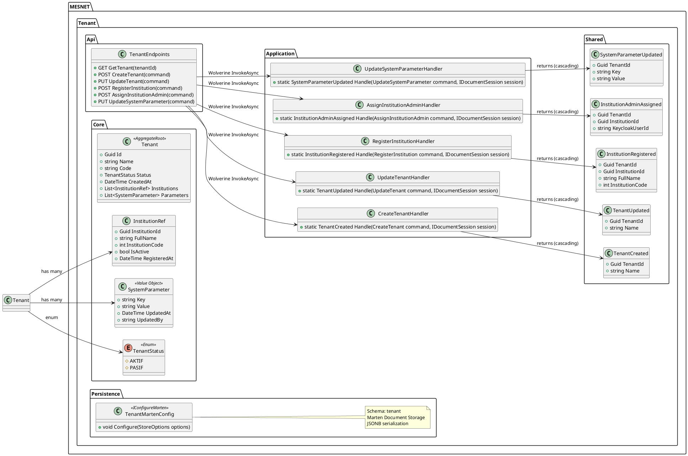
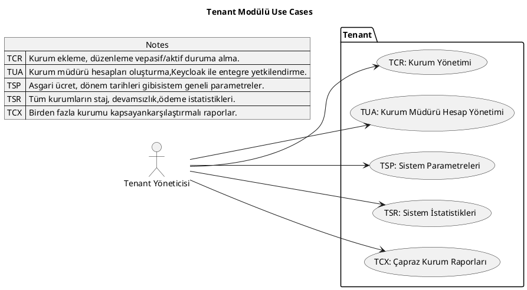
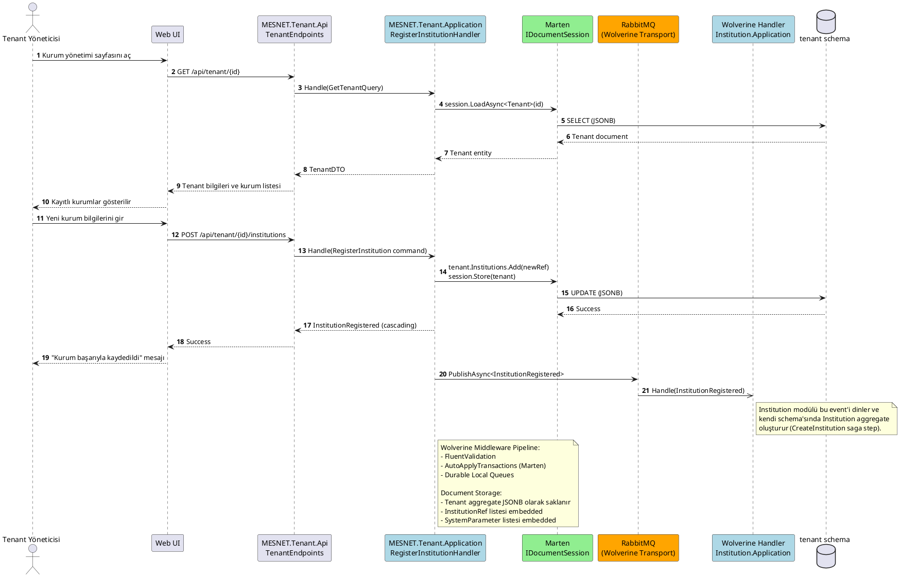

# Tenant Modülü (Phase 2)

:::warning[Phase 2]
Tenant modülü Phase 2 kapsamındadır. Phase 1'de tek kurum odaklı çalışılmaktadır.
:::

Çoklu kurum yönetimi, sistem yapılandırma.

## Class Diagram

## Use Cases

## Sequence Diagrams

### Kurum Kayıt (RegisterInstitution)

